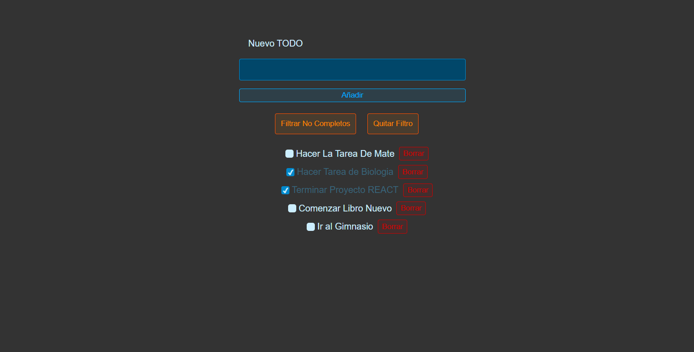

# ToDo App in React



## Overview

This is a simple ToDo application built with React. It is based on a tutorial from [YouTube](https://youtu.be/Rh3tobg7hEo?si=bHSiC-03VYHNoLV2), with additional features and enhancements. The project is aimed at learning and understanding React components and state management.

## Features

- Add new tasks
- Mark tasks as completed
- Delete tasks
- Filter to show only incomplete tasks

## Installation

1. Clone the repository:
    ```sh
    git clone https://github.com/jvegav/ToDo-React.git
    ```

2. Install the dependencies:
    ```sh
    npm install
    ```

## Usage

1. Start the development server:
    ```sh
    npm run dev
    ```

2. Open your browser and navigate to [http://localhost:5173/](http://localhost:5173/)

## Code Structure

- `App.js`: Main component that handles state and renders other components.
- `Form.js`: Component for the input and label for adding a new task.
- `Filter.js`: Component for the buttons to filter the tasks.
- `List.js`: Component for the list of tasks.
- `TodoItem.js`: Component for representing each task with buttons to check and delete.

## Learning Goals

- Understanding the structure of React applications
- Learning how to manage state in React using `useState`
- Utilizing `useEffect` for side effects
- Implementing CRUD operations in a React app

## Contributing

Feel free to fork this project, open issues, and submit pull requests.


    
